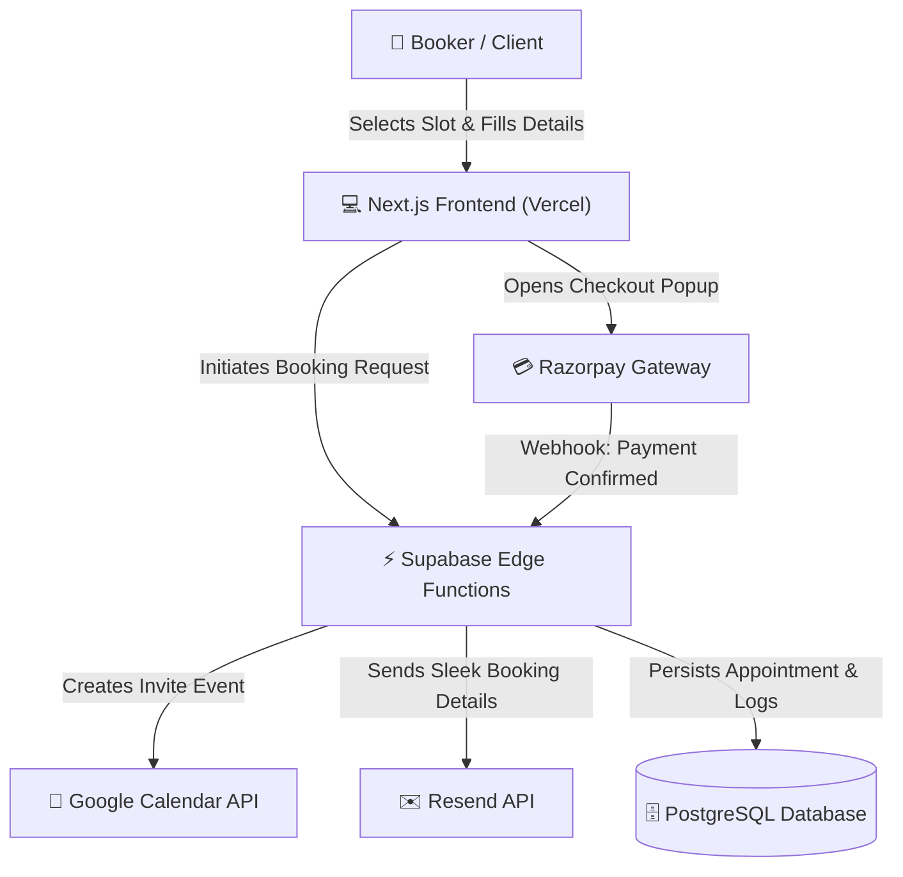

# 📂 Calendify Documentation Directory

Welcome to the official documentation folder for the **Automated Scheduling & Payment Platform (Calendify / kuttapi)**. This directory contains all strategic, technical, and financial resources related to the project.

---

## 🗺️ Documentation Map

To help you navigate through the project requirements, design architecture, and proposal, here is a quick directory of the documents:

| Document / Resource | Format | Description |
| :--- | :---: | :--- |
| 📋 **[Product Requirements Document (PRD)](file:///c:/Users/Abhi/Desktop/kuttapi/docs/project_prd.md)** | Markdown | Core features, target personas, technical stack constraints, key user flows, and phase roadmap. |
| 💰 **[Project Proposal & Quotation](file:///c:/Users/Abhi/Desktop/kuttapi/docs/project_quotation.md)** | Markdown | Implementation timeline, breakdown of costs (₹20,000 budget limit), milestone-based payment schedules, and zero-cost serverless architecture diagram. |
| 📄 **[Quotation PDF (TC-2026-SCH-001)](file:///c:/Users/Abhi/Desktop/kuttapi/docs/Project_Quotation_TC-2026-SCH-001.pdf)** | PDF | The official formatted proposal PDF ready for client presentation. |
| 📝 **[Quotation Word Doc (TC-2026-SCH-001)](file:///c:/Users/Abhi/Desktop/kuttapi/docs/Project_Quotation_TC-2026-SCH-001.docx)** | DOCX | Word version of the quotation for editing and tracking changes. |

---

## ⚡ Project Concept & Architecture

Calendify is a premium automated scheduling platform designed specifically for independent consultants in the Indian market. It bridges the gap between booking availability and instant payments to eliminate client no-shows completely.

### Key Pillars of the Platform:
1. **Google Calendar Sync:** Real-time bi-directional checks ensuring busy slots are fully respected and appointments are auto-populated.
2. **Instant UPI & Card Checkouts:** Tailored for the Indian market via a premium Razorpay checkout modal with strict 10-minute temporary locks on chosen slots.
3. **Dual Notifications:** Automatically mails booking confirmations (with `.ics` files attached) to clients, and administrative payment/appointment details to the consultant.
4. **Zero Fixed Cost:** Designed around generous serverless free tiers (Next.js on Vercel, Supabase PG & Edge Functions, Resend), requiring **₹0 in fixed monthly maintenance costs**.

---

## 🛠️ Tech Stack & Services

| Layer | Provider | Pricing / Tier |
| :--- | :--- | :--- |
| **Frontend** | Next.js / React | **₹0** (Vercel Hobby Tier) |
| **Database & API** | Supabase (PostgreSQL & Edge Functions) | **₹0** (Supabase Free Tier) |
| **Email Delivery** | Resend | **₹0** (Up to 3,000 transaction emails/mo) |
| **DNS / Security** | Cloudflare | **~₹600 - ₹1,100 / Year** (Domain Registration) |
| **Payments** | Razorpay | **2% + GST** (Pay-as-you-go per transaction) |

---

## 🚀 Timeline & Next Steps

The implementation is planned over **20 days** divided into 4 key phases:

1. **Phase 1 (Days 1–5):** UX/UI Branding & Responsive Screens layout.
2. **Phase 2 (Days 6–12):** Google Calendar API OAuth configuration & core scheduling rules.
3. **Phase 3 (Days 13–17):** Razorpay checkout API hooks and DB persistent logging.
4. **Phase 4 (Days 18–20):** Operational sandboxed testing, Resend workflow, and production rollout on custom domain.
