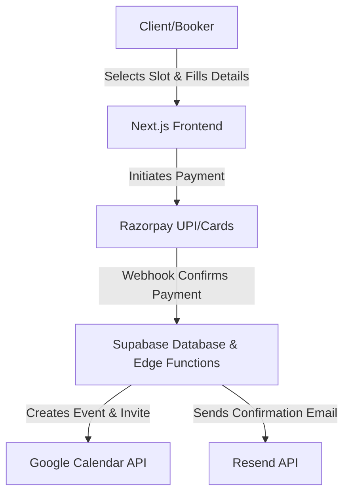

# Project Proposal & Quotation: Automated Scheduling & Payment Platform

> [!NOTE]
> **Prepared For:** Independent Consultants & Counselors (Indian Market)  
> **Project Type:** Premium, Automated Scheduling & Payment Platform  
> **Objective:** Premium scheduling and payment platform with zero fixed monthly maintenance (Name TBD).  
> **Currency:** Indian Rupees (INR)

---

## 1. Project Overview & Deliverables
The proposed platform is designed as a direct competitor to international platforms like Calendly but optimized for the Indian market with UPI integrations and zero-cost serverless maintenance. The solution will be responsive, elegant, and secure.

### Core Modules

*   **Google OAuth 2.0 Integration:** Secure authentication for the consultant to read busy slots and write new booked sessions.
*   **Intelligent Scheduling Engine:** Automated availability rules, time-zone matching, minimum notice logic (4 hours buffer), and customizable session buffers.
*   **Payment-Locked Bookings:** Seamless Razorpay integration (UPI, RuPay, Debit/Credit Cards). Slots are provisionally reserved for 10 minutes and permanently confirmed only via secure webhooks post-payment.
*   **Dual Auto-Notifications (Free Tier Compatible):** Fully automated via Resend using a verified custom domain:
    *   *For Booker (Client):* Instant, sleek email confirmation with session details and an attachment containing the Google Calendar invite (.ics file).
    *   *For Admin (Consultant):* Immediate notification sent to your personal email address with all client details and payment receipt.
*   **Admin Dashboard:** Modern, interactive dashboard for the consultant to monitor upcoming/past bookings, transaction status, and customize scheduling settings. All data is securely stored in a database and fully visible in real-time.

---

## 2. Zero-Cost Infrastructure Architecture
The platform is designed around a **Zero Fixed Monthly Maintenance** budget, utilizing high-performance free tiers:

| Infrastructure Component | Service Provider | Monthly Hosting Cost |
| :--- | :--- | :--- |
| **Frontend Web Hosting** | Vercel (Next.js Edge) | ₹0 (Free Tier) |
| **Database & Auth** | Supabase (PostgreSQL) | ₹0 (Free Tier) |
| **Backend API / Logic** | Supabase Edge Functions | ₹0 (Free Tier) |
| **Email Gateway** | Resend (Transactional) | ₹0 (Up to 3,000/mo) |
| **Custom Domain & DNS** | Cloudflare Security | ~₹600 - ₹1,100 / Year |
| **Transaction Processing** | Razorpay Gateway | 2% + GST per successful payment |

---

## 3. Financial Quotation (One-Time Cost)
Below is the budget breakdown optimized to fit within the custom target budget of **₹20,000**:

| Task ID | Component & Deliverables | Cost (INR) |
| :--- | :--- | :--- |
| **SP-01** | **UX/UI Design, Branding & Frontend Layout** • Fully responsive Next.js web application layout • Elegant landing page and custom profile routing (e.g., `/consultant-name`) | **₹4,000** |
| **SP-02** | **Scheduling Engine & Google Calendar Integration** • Timezone intelligence, buffer time constraints, and timezone-agnostic calendar bookings • Secure Google Calendar API OAuth integration | **₹6,500** |
| **SP-03** | **Razorpay Integration & Secure Webhooks** • Instant UPI/RuPay payment popups • Secure webhook handler to confirm bookings only after payment success | **₹4,000** |
| **SP-04** | **Backend Setup & Supabase Database Core** • Database schema design (Clients, Appointments, Config) • Supabase Edge Functions for handling transactional flow | **₹3,500** |
| **SP-05** | **Communications & Custom Domain Launch** • Resend email notifications setup (automated booking confirmations) • Cloudflare DNS configuration, performance optimization, and SSL launch | **₹2,000** |
| | **Total One-Time Implementation Fee** | **₹20,000** |

---

## 4. Project Roadmap & Timeline
We anticipate completing this implementation in **20 Days** from kick-off:

```mermaid
gantt
    title Platform Development Timeline
    dateFormat  D
    axisFormat %d
    section Implementation
    UX/UI Design & Frontend Layout (SP-01)    :active, 1, 5
    Google Calendar & Scheduling Core (SP-02)  : 6, 12
    Razorpay Integration & Webhook (SP-03)    : 13, 16
    Supabase DB & Edge Functions (SP-04)       : 12, 17
    Email Sync, Domain Setup & Launch (SP-05)  : 17, 20
```

*   **Milestone 1 (Day 1 - 5):** Delivery of interactive UI mockups and frontend responsive screens.
*   **Milestone 2 (Day 6 - 12):** Active Google Calendar synchronization, scheduling rules, and busy slot detection.
*   **Milestone 3 (Day 13 - 17):** End-to-end Razorpay checkouts, database integration, and booking confirmation logic.
*   **Milestone 4 (Day 18 - 20):** Operational tests, transactional email routing, custom domain onboarding, and production launch.

---

## 5. Milestone-Based Payment Terms
To ensure transparent progress and alignment, payment is structured across key project stages:

*   **40% Advance Payment (₹8,000):** Due upon project kick-off to initiate DB setup, branding, and UI/UX layouts.
*   **40% Mid-Project Milestone (₹8,000):** Due after validation of frontend interface, calendar API connection, and busy-slot scheduling logic.
*   **20% Final Handoff (₹4,000):** Due after Razorpay checkout integration, email confirmation routing, custom domain setup, and successfully hosting the live MVP.

---

> [!TIP]
> **Warranty & Support:** Includes **30 Days of complimentary post-launch support** to resolve any deployment issues, API token renewals, or database optimizations.
